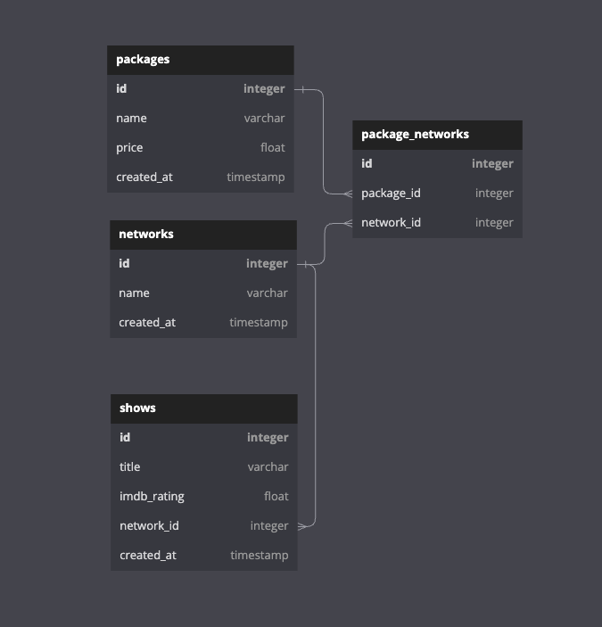
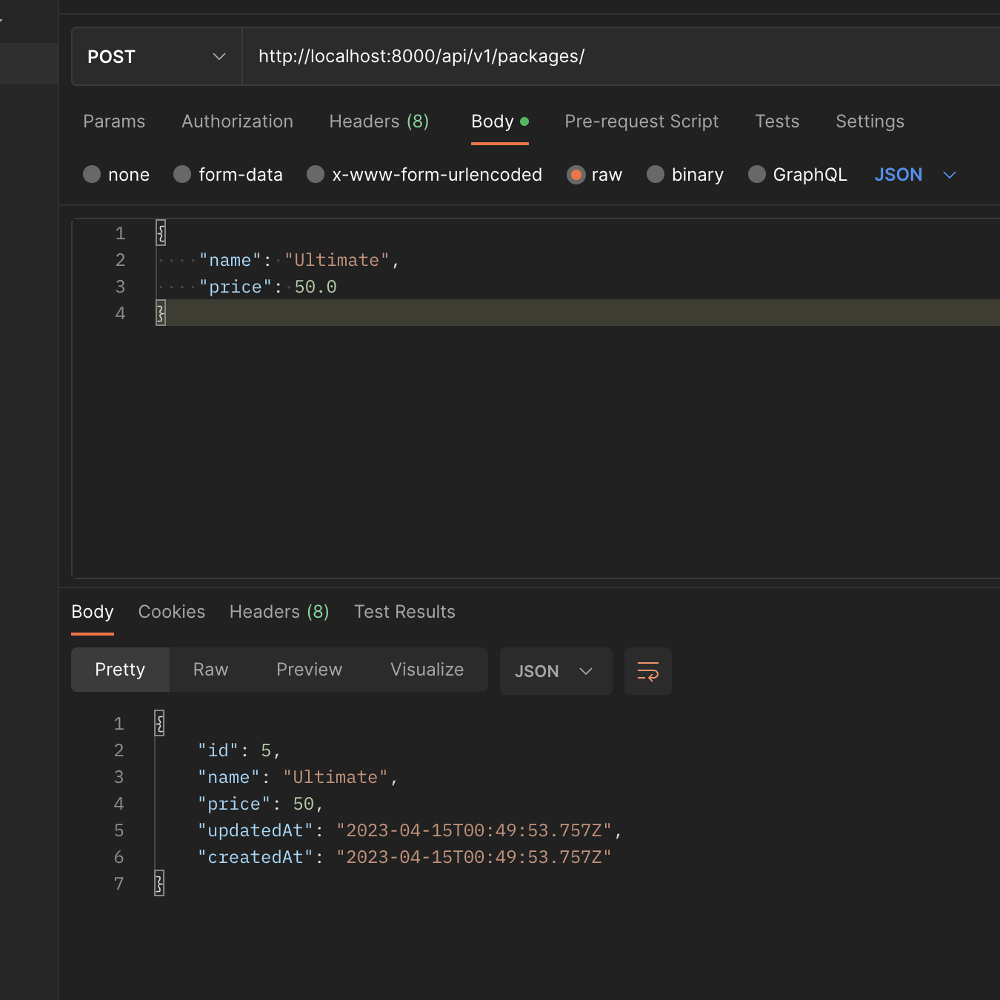
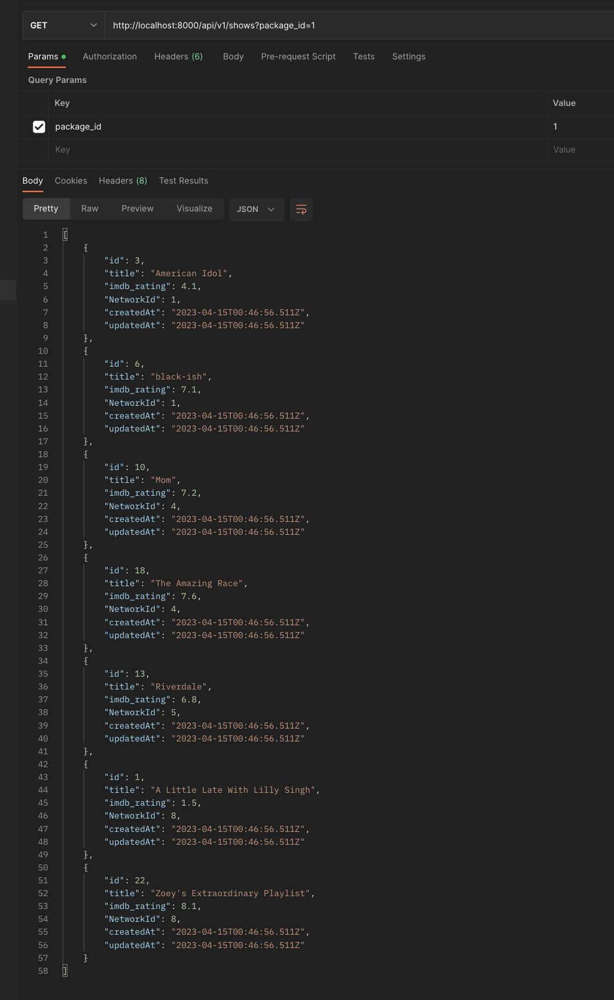
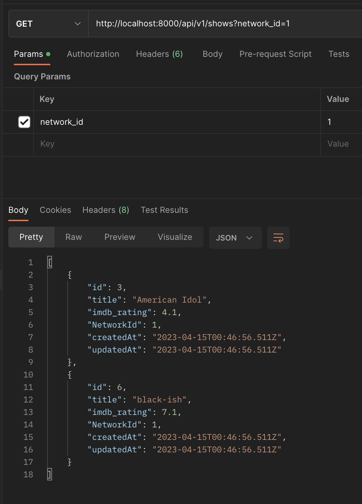
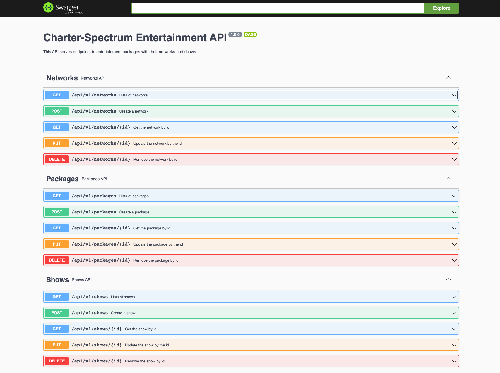

# NodeJS PostgreSQL API

## Charter/Spectrum Back-End Code Challenge

## Summary

Create a REST API using Node.js and PostgreSQL. Seed the database from the data provided and expose REST APIs with some specific filtering requirements.

## Table of Contents

- [Requirements](#requirements)
- [Stack](#stack)
- [Schema](#schema)
- [Installation](#installation)
- [Endpoints](#endpoints)
  * [Postman](#postman)
  * [List of Endpoints](#list-of-endpoints)
  * [Swagger UI](#swagger-ui)

## Requirements

- REST API using Node / Express API with PostgreSQL Database

- README with clear instructions on how to run and use the application

- Seed script that seeds the PostgreSQL Database with the provided data

- CRUD APIs for each entity

- GET Shows and filter by Network (ex: /shows?network_id=1)

- GET Shows and filter by Package (ex: /shows?package_id=1)

- GET Package by ID should also provide all Networks included in that Package (ex: /packages/:id)

## Stack

- NodeJS
- ExpressJS
- PostgreSQL
- Sequelize

## Schema

The project includes three main tables and a through-table.

Based on the data provided as json:

- A 'package' has many networks.
- A 'network' belongs to many packages.
- A 'network' has mnay shows.
- A 'show' belongs to a network.

To avoid nesting packages and network are associated through a join table named 'packageNetworks'.
A 'packageNetworks' table has both a package and a network foreign key.
A 'show' belongs to a newtork only so there is a reference to network in 'show' with a foreing key.

### Schema Diagram

<div align="center">



</div>

## Installation

1. Make sure you have **[yarn](https://classic.yarnpkg.com/lang/en/docs/install/#mac-stable)** installed
1. Clone this repo `git clone git@github.com:Coding-Gymnasium/node-express-api-2023.git`
1. Cd to project and run `yarn install`
1. Set psql user:
   ```bash
       $ psql
       <default-user>=# CREATE USER postgres WITH PASSWORD "postgres";
       <default-user>=# GRANT ALL PRIVILEGES ON DATABASE node_express_api_dev TO postgres;
   ```
1. Create database `npx sequelize-cli db:create`
1. Migrate tables `yarn migrate:up`
1. Seed tables. Note: because of the associations the tables need to be seed in order. Please use the following command:
   `yarn seed-in-order`
1. Run project `yarn start`

## Endpoints

### Postman

#### Using Postman try the following endpoints

[](https://app.getpostman.com/run-collection/12873084-4e6e2d03-a872-42e8-9917-240cce764279?action=collection%2Ffork&collection-url=entityId%3D12873084-4e6e2d03-a872-42e8-9917-240cce764279%26entityType%3Dcollection%26workspaceId%3D6447471c-b7e7-4b44-b57f-195ae31e6b00)

#### Sample Endpoints

##### View All Packages

<div align="center">
    
</div>

##### View Shows by Package

<div align="center">
    
</div>

##### View Shows by Package

<div align="center">
    
</div>

##### View Networks by Package

<div align="center">
    
</div>

### List of Endpoints

<hr />

#### Packages

##### Create a Package

POST ➡️ `http://localhost:8000/api/v1/packages/`

```json
{
  "name": "Gold"
}
```

##### Get All Packages

GET ➡️ `http://localhost:8000/api/v1/packages/`

##### Get Package by ID

GET ➡️ `http://localhost:8000/api/v1/packages/1`

- Displays Networks associated with package

##### Update Package by ID

PUT ➡️ `http://localhost:8000/api/v1/packages/1`

Change price

```json
{
  "price": 19.9
}
```

##### Delete Package by ID

DELETE ➡️ `http://localhost:8000/api/v1/packages/1`

##### Delete ALL Packages

DELETE ➡️ `http://localhost:8000/api/v1/packages`

<hr />

#### Networks

##### Create a Network

POST ➡️ `http://localhost:8000/api/v1/networks/`

```json
{
  "name": "ABC"
}
```

##### Get All Networks

GET ➡️ `http://localhost:8000/api/v1/networks/`

##### Get Network by ID

GET ➡️ `http://localhost:8000/api/v1/networks/1`

##### Update Network by ID

PUT ➡️ `http://localhost:8000/api/v1/networks/1`

Change name

```json
{
  "name": "CBS"
}
```

##### Delete Network by ID

DELETE ➡️ `http://localhost:8000/api/v1/networks/1`

##### Delete ALL Networks

DELETE ➡️ `http://localhost:8000/api/v1/networks`

<hr />

#### Shows

##### Create a Show

POST ➡️ `http://localhost:8000/api/v1/shows/`

```json
{
  "title": "American Gods",
  "imdb_rating": 7.7
}
```

##### Get All Shows

GET ➡️ `http://localhost:8000/api/v1/shows/`

##### Get Associated Shows by Package Id

GET ➡️ `http://localhost:8000/api/v1/shows?package_id=1`

##### Get Associated Shows by Networks Id

GET ➡️ `http://localhost:8000/api/v1/shows?network_id=2`

##### Get Show by ID

GET ➡️ `http://localhost:8000/api/v1/shows/1`

##### Update Show by ID

PUT ➡️ `http://localhost:8000/api/v1/shows/1`

Change title

```json
{
  "title": "Forge in Fire"
}
```

Change network

```json
{
  "NetworkId": 2
}
```

##### Delete Show by ID

DELETE ➡️ `http://localhost:8000/api/v1/shows/1`

##### Delete ALL Shows

DELETE ➡️ `http://localhost:8000/api/v1/shows`

<hr />

#### Connect Network to Package

##### Create a PackageNetwork

POST ➡️ `http://localhost:8000/api/v1/packageNetworks/`

```json
{
  "NetworkId": 1,
  "PackageId": 2
}
```

##### Get All PackageNetworks

GET ➡️ `http://localhost:8000/api/v1/packageNetworks/`

##### Get PackageNetwork by ID

GET ➡️ `http://localhost:8000/api/v1/packageNetworks/1`

##### Update PackageNetwork by ID

PUT ➡️ `http://localhost:8000/api/v1/packageNetworks/1`

```json
{
  "id": 4
}
```

##### Delete PackageNetwork by ID

DELETE ➡️ `http://localhost:8000/api/v1/packageNetworks/1`

##### Delete ALL PackageNetworks

DELETE ➡️ `http://localhost:8000/api/v1/packageNetworks`

<hr />

### Swagger UI

To use the swagger ui please navigate to:

`http://localhost:8000/api-docs`

<div align="center">

  

</div>
